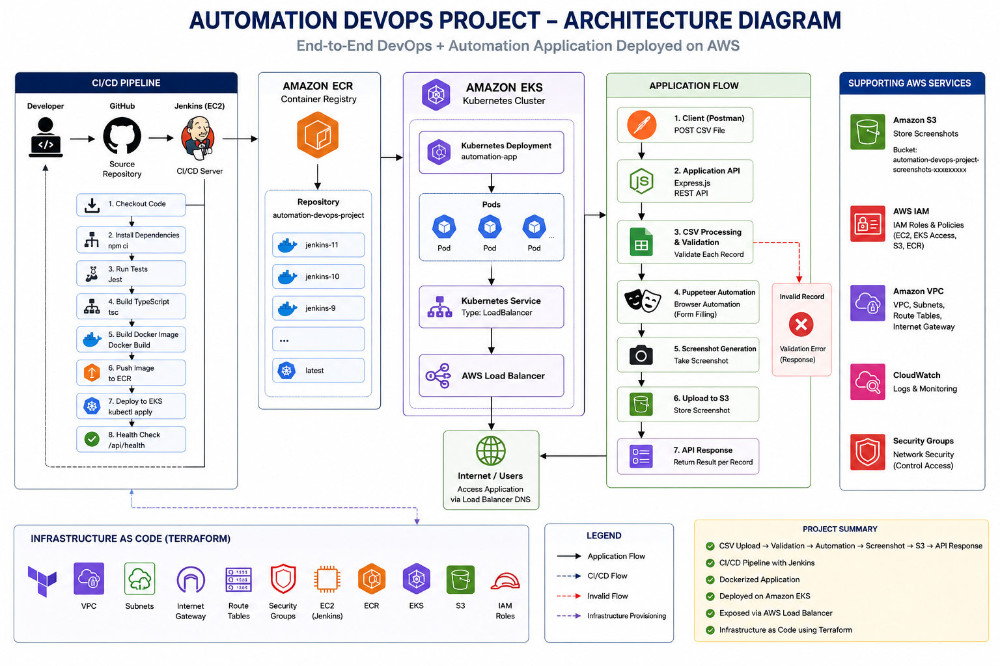

# 🚀 Automation DevOps Project

An end-to-end DevOps project demonstrating CI/CD automation for a Node.js + TypeScript application using Jenkins, SonarQube, Docker, and AWS ECR.

---

## 📌 Project Overview

This project showcases a complete CI/CD pipeline that automatically:

- Pulls source code from GitHub
- Installs project dependencies
- Performs code quality checks using ESLint
- Builds the TypeScript application
- Runs unit tests using Jest
- Publishes test reports in Jenkins
- Performs static code analysis using SonarQube
- Validates the Quality Gate
- Builds a Docker image
- Pushes the Docker image to Amazon Elastic Container Registry (ECR)
- Deploys the application as a Docker container
- Performs an automated health check

---

# 🏗️ Architecture

> Replace the image below with your architecture diagram.



---

# ⚙️ Tech Stack

## Backend

- Node.js
- TypeScript
- Express.js
- Puppeteer

## DevOps

- Jenkins
- Docker
- SonarQube
- AWS ECR
- GitHub
- Jest
- ESLint

---

# 📂 Project Structure

```text
automation-devops-project
│
├── src
│   ├── automation
│   ├── controllers
│   ├── routes
│   ├── services
│   ├── tests
│   ├── utils
│   ├── app.ts
│   └── server.ts
│
├── Dockerfile
├── Jenkinsfile
├── sonar-project.properties
├── jest.config.js
├── package.json
└── README.md
```

---

# 🔄 CI/CD Pipeline

The Jenkins pipeline performs the following stages:

```
GitHub
   │
   ▼
Checkout Source
   │
   ▼
Install Dependencies
   │
   ▼
ESLint
   │
   ▼
Build TypeScript
   │
   ▼
Unit Tests
   │
   ▼
Publish Test Results
   │
   ▼
SonarQube Analysis
   │
   ▼
Quality Gate
   │
   ▼
Docker Build
   │
   ▼
Push Docker Image to AWS ECR
   │
   ▼
Run Docker Container
   │
   ▼
Health Check
```

---

# 🧪 Quality Checks

✔ ESLint

✔ Jest Unit Tests

✔ SonarQube Static Code Analysis

✔ Sonar Quality Gate

✔ Jenkins Test Reports

---

# 🐳 Docker

## Build Image

```bash
docker build -t automation-devops-project .
```

## Run Container

```bash
docker run -d -p 3000:3000 automation-devops-project
```

---

# ☁️ AWS ECR Integration

The Jenkins pipeline automatically:

- Authenticates with AWS
- Builds Docker Image
- Tags Docker Image
- Pushes Docker Image to Amazon ECR

Example Image:

```
218589468002.dkr.ecr.us-east-1.amazonaws.com/automation-devops-project:latest
```

---

# 📊 Jenkins Pipeline Features

- Source Code Checkout
- Dependency Installation
- Static Code Analysis
- Unit Testing
- Test Report Publishing
- SonarQube Integration
- Quality Gate Validation
- Docker Build
- AWS ECR Push
- Docker Deployment
- Health Check

---

# 🚀 Getting Started

## Clone Repository

```bash
git clone https://github.com/Sudhir-lab-dev/devopsAutomationProject.git
```

---

## Install Dependencies

```bash
npm install
```

---

## Run Application

```bash
npm run dev
```

---

## Run Tests

```bash
npm test
```

---

## Build Project

```bash
npm run build
```


# 📈 Future Enhancements

- Terraform Infrastructure as Code
- Jenkins on AWS EC2
- Amazon ECS Deployment
- Kubernetes (EKS)
- GitHub Webhooks
- Multi-Environment Deployment
- CloudWatch Monitoring
- Blue/Green Deployment
- Automated Rollback

---

# 👨‍💻 Author

**Sudhir G. Mhaske**

Software Engineer | AWS DevOps Engineer | QA Automation Engineer


🔗 GitHub:
https://github.com/Sudhir-lab-dev

---

# ⭐ If you like this project

Give it a ⭐ on GitHub!
